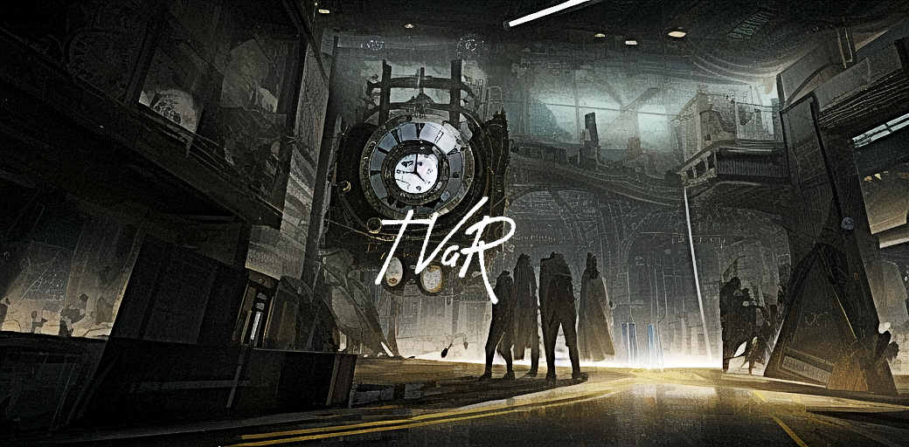

# TVaR


## Requirements
1. Docker and Docker Compose: You can download them [here](https://www.docker.com/products/docker-desktop).
2. Python 3.x and Conda: You can download them from [Anaconda distribution](https://www.anaconda.com/products/distribution) or [Miniconda](https://docs.conda.io/en/latest/miniconda.html). 

## Setup

Clone this repository to your local machine and navigate to the directory containing the Makefile.
```
git clone <repository-url>
cd <repository-directory>
```

To create the `tvar` conda environment, run the following command:

```
conda create --name tvar python=3.8
conda activate tvar
pip install -r requirements.txt
```


## How to use the Makefile
### Preprocess the Data
To run the preprocessing script:

```
make pp
```


### Train

To run the training script:

```
make train
```

### Inference

To run the inference script:

```
make infer
```

### TensorBoard
To start TensorBoard:

```
make panel
```