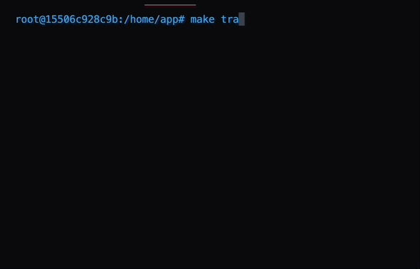

# TVA: Sequential Recommendation Playground


This project is built around `PyTorch-Lightning`, offering a structured and friendly environment for anyone exploring sequential recommendation systems. This platform is designed to simplify the machine learning workflow, letting you focus more on the strategic aspects of model development and less on setup complexities.

## Requirements
1. Docker and Docker Compose: You can download them [here](https://www.docker.com/products/docker-desktop).
2. Python 3.x and Conda: You can download them from [Anaconda distribution](https://www.anaconda.com/products/distribution) or [Miniconda](https://docs.conda.io/en/latest/miniconda.html). 

## Setup

Clone this repository to your local machine and navigate to the directory containing the Makefile.
```
git clone https://github.com/Aidenzich/TVA.git
cd TVA
```

We use conda as default environment in this repo. To create the `tvar` conda environment, run the following command:

```
conda create --name tvar python=3.8
conda activate tvar
pip install -r requirements.txt
```

## Functionalities


- 🗣️ Training, Preprocessing, Inference with Interactive Commands 
- 📊 Well-organized logging and TensorBoard visualization
- 📑 Configs based hyperparameters and configurations system

## Support Models
| Model | Venue | Year | Support |
|-|-|-|-|
| TVA (a model still in development, the concept is to enable the model to aware Temporal Variance) | - | - | - |
| [ContrastVAE: Contrastive Variational AutoEncoder for Sequential Recommendation](https://arxiv.org/abs/2209.00456) | CIKM |  ['22](https://www.cikm2022.org/papers-posters) | [✓](https://github.com/YuWang-1024/ContrastVAE) |
| [CBiT: Contrastive Learning with Bidirectional Transformers for Sequential Recommendation](https://arxiv.org/abs/2208.03895)| CIKM | ['22](https://www.cikm2022.org/papers-posters) | [✓](https://github.com/hw-du/CBiT/tree/master.) |
| [BERT4Rec: Sequential Recommendation with Bidirectional Encoder Representations from Transformer](https://arxiv.org/abs/1904.06690) | CIKM | ['19](https://dl.acm.org/doi/proceedings/10.1145/3357384) | [✓](https://github.com/Aidenzich/BERT4Rec-VAE-Pytorch) |
| [VAECF: Variational Autoencoders for Collaborative Filtering](https://dl.acm.org/doi/abs/10.1145/3178876.3186150) | WWW | ['18](https://dl.acm.org/doi/proceedings/10.5555/3178876#heading7) | [✓](https://github.com/PreferredAI/cornac) |
| [SASRec: Self-Attentive Sequential Recommendation](https://ieeexplore.ieee.org/abstract/document/8594844?casa_token=KSghig8Awq4AAAAA:jd_bRp3qNTzU-E_L0h_l1bCBQMaUL3MgDhUKpu1FbspTD0UMPZNVVh8BElcQ2_733hId9DNC3A) | ICDM | ['18](https://icdm2018.org/program/list-of-accepted-papers/) | [✓](https://github.com/kang205/SASRec) |

## Usage
### Preprocess the Data
To run the preprocessing script:

```
make pp
```

### Train

To run the training script:

```
make train
```

### Inference

To run the inference script:

```
make infer
```

### TensorBoard
To start TensorBoard:
```
make panel
```